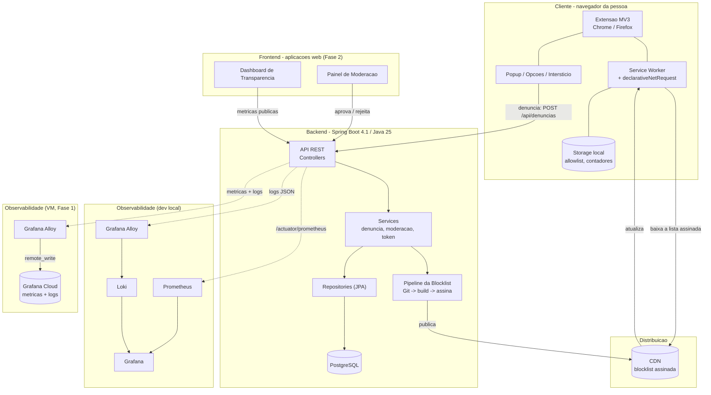
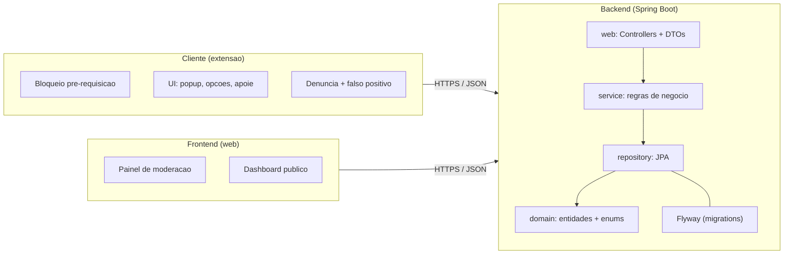

# Arquitetura (backend, frontend e cliente)

Visão técnica de ponta a ponta. O sistema tem três camadas que conversam entre si, mais a distribuição da lista e a observabilidade:

- **Cliente** — a extensão de navegador que roda no computador da pessoa (bloqueio local).
- **Frontend** — aplicações web usadas por moderadores e pelo público (painel e dashboard).
- **Backend** — a API Spring Boot, o banco e o pipeline que gera a blocklist.

> Estado atual: o **backend** já processa denúncia, moderação e autenticação — falta só a publicação real da blocklist. O **cliente** está em construção. O **frontend** (painel de moderação e dashboard) entra na Fase 2 do roadmap. Até lá, a moderação acontece por chamada direta e autenticada à API.

## Diagrama geral

Na VM da Fase 1 roda **só o Alloy**: Prometheus, Loki e Grafana locais consumiam mais RAM
que o próprio backend em idle, o que anulava o ganho de caber no free tier ao lado do
Postgres. A stack completa continua disponível para desenvolvimento e para quando o
projeto crescer o bastante para justificar hospedá-la de novo — ver
[Como rodar](como-rodar.md).

## O caminho de um dado, camada a camada

### Backend -> Frontend -> Cliente (distribuição da lista)
1. Um moderador aprova um domínio chamando a **API (backend)** direto, autenticado por HTTP Basic. O **painel (frontend)** ainda não existe — é a interface planejada para a Fase 2.
2. O backend registra no **PostgreSQL** e o **pipeline** faz commit no Git, gera e **assina** a blocklist.
3. A lista assinada é publicada na **CDN**.
4. A **extensão (cliente)** baixa a lista atualizada e passa a bloquear o domínio — validando a assinatura antes de aplicar.

### Cliente -> Backend (denúncia colaborativa)
1. A pessoa clica em "denunciar" na **extensão (cliente)**.
2. A extensão envia o domínio (anônimo) para a **API (backend)** via `POST /api/denuncias`.
3. O backend coloca em **quarentena**. A denúncia só vira bloqueio após revisão humana de um moderador, hoje via API autenticada.

## Detalhamento por camada

## Tecnologias por camada

| Camada | Tecnologias |
|--------|-------------|
| Cliente | Extensão WebExtension (Manifest V3), TypeScript, `declarativeNetRequest` |
| Frontend | Aplicação web (a definir na Fase 2) consumindo a API REST |
| Backend | Spring Boot 4.1, Java 25, Spring Data JPA, Flyway, MapStruct, springdoc |
| Banco | PostgreSQL 18 |
| Distribuição | Blocklist assinada em CDN estático |
| Observabilidade | Actuator + Micrometer -> Prometheus; logs -> Grafana Alloy -> Loki; dashboards no Grafana |

---

> Princípio central: **o bloqueio é local e determinístico no cliente.** A inteligência e a curadoria são remotas e humanas, no backend e no frontend. A comunicação entre camadas é sempre HTTPS com JSON, e a blocklist trafega assinada.
