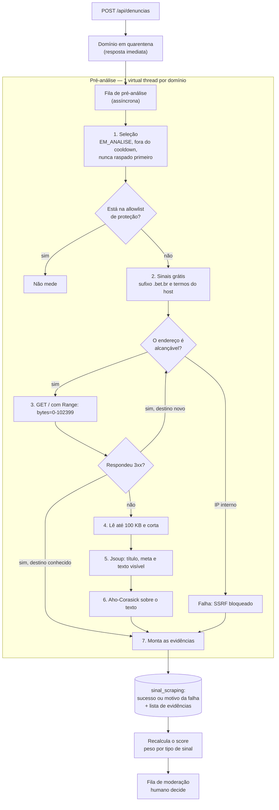

# Pré-análise automática de domínios

Este documento define como o Chega de Bet analisa um domínio **antes** da moderação humana. A pré-análise busca sinais de aposta no HTML do site e entrega evidência para o moderador. Ela nunca decide sozinha.

O documento traz as medições que sustentam cada decisão, o desenho recomendado e as alternativas descartadas com o motivo.

> **Nota:** o termo do projeto é **pré-análise**. Não use "pré-check", "scan" ou "crawler" para a mesma coisa.

---

## 1. O que a pré-análise faz e o que ela não faz

| Faz | Não faz |
|---|---|
| Baixa o HTML do domínio denunciado. | Executa JavaScript da página. |
| Procura sinais de aposta no HTML. | Extrai dados, imagens ou conteúdo do site. |
| Grava as evidências encontradas. | Decide a categoria (`ESPORTIVA` ou `CASSINO`). |
| Marca o domínio como suspeito, limpo ou indeterminado. | Aprova, rejeita ou altera o `StatusDominio`. |
| Ordena a fila de moderação por prioridade. | Adiciona domínio na blocklist. |

A pré-análise é uma **ferramenta do moderador**. Um falso positivo do projeto é falha crítica, e a única barreira contra ele continua sendo o humano no loop.

---

## 2. As medições

Medimos quatro sites de aposta reais e dois sites legítimos de controle, em 08/08/2026, com um `GET` simples.

### 2.1 Onde o tempo é gasto

| Site | Bytes do HTML | TTFB |
|---|---|---|
| betnacional.com | 605.127 | 0,25 s |
| betano.com.br | 277.137 | 0,43 s |
| blaze.com | 24.127 | 0,25 s |
| esportesdasorte.com | 10.037 | 0,73 s |

Varrer o maior arquivo (605 KB) inteiro, em memória, sem nenhum match: **0,136 ms**. Varrer o mesmo arquivo parando no primeiro match: **0,0015 ms**.

A rede custa entre **1.800x** e **165.000x** a varredura. Qualquer otimização da varredura é ruído. O tempo está na rede.

### 2.2 Onde o sinal está no documento

| Site | 1ª ocorrência de "bet" | 1ª ocorrência de "cassino" |
|---|---|---|
| betnacional.com | byte 1.220 de 605.127 | byte 1.457 |
| betano.com.br | byte 971 de 277.137 | byte 15.652 |
| blaze.com | byte 272 (meta keywords) | não encontrado |
| esportesdasorte.com | byte 6.340 (variável CSS) | não encontrado |

O sinal está nos primeiros 0,2% a 0,4% do documento. Isso não é sorte: o sinal mora no `<head>`, em `<title>`, `<meta>` e `og:tags`. A distribuição do sinal é fortemente concentrada no início.

### 2.3 Metade da amostra é indetectável por HTML estático

`esportesdasorte.com` é uma aplicação Angular. O HTML entregue tem `<title></title>` vazio, zero ocorrências de "cassino", zero de "aposta" e zero de "slot". A única ocorrência de "bet" é a variável CSS `--bet-win-color`.

Pior: a única ocorrência de "casino" no arquivo inteiro é o nome de um ícone do Google Material Symbols, dentro de uma URL de fonte:

```
icon_names=account_balance,...,call_received,casino,check,...
```

`blaze.com` também não tem "cassino". O único sinal útil está em `<meta name="keywords" content="esports betting casino dice roulette">`.

> **Atenção:** dois dos quatro alvos não são classificáveis por palavra-chave no HTML estático. A pré-análise precisa de um resultado `INDETERMINADO` e precisa usá-lo com frequência.

### 2.4 O custo da própria pré-análise

As medições acima dizem quanto custa a rede. Estas dizem quanto custa o nosso código, medido depois que ele existia — com `Statistics` do Hibernate para o banco e um laço de 200 voltas para o matcher.

| O que | Antes | Depois |
|---|---|---|
| Analisar um documento de 100 KB | 5.083 µs | **1.988 µs** |
| Consultas SQL por domínio | 6,1 | **4,1** |
| Consultas JPQL por ciclo de 10 domínios | 31 | **11** |
| Ciclo completo de 10 domínios | 835 ms | **497 ms** |

O perfil apontou dois desperdícios, e nenhum dos dois era o autômato:

- **55% era normalização de texto.** Quatro passagens sobre os 100 KB — `Normalizer.normalize`, uma regex para tirar diacrítico, `toLowerCase`, outra regex para colapsar espaço — cada uma alocando uma String nova. Viraram uma passagem só, escrevendo em um buffer do tamanho certo. Só a normalização antiga (2.837 µs) custava mais que a análise inteira de hoje.
- **15% era parse repetido.** O worker perguntava duas coisas ao matcher, e cada método parseava o HTML por conta própria.

> **Nota:** o número que **não** mudou é o do Aho-Corasick. A varredura continua custando microssegundos, exatamente como a seção 6.1 previa. Otimizar a varredura seria ruído; o custo estava em volta dela.

### 2.5 Os falsos positivos são reais

| Site de controle | "cassino" | "aposta" | "bet" |
|---|---|---|---|
| g1.globo.com | 0 | 6 | 8 |
| www.uol.com.br | 0 | 0 | 32 |

Sem fronteira de palavra, "bet" casa com Betim, diabetes, Tibet, beta e Roberto. Cinco dos dezenove matches de "bet" no `blaze.com` são o nome do arquivo `betbr-blaze-prodfavicon.ico`.

---

## 3. O desenho recomendado

### 3.1 Visão geral



### 3.2 As cinco decisões

**1. A pré-análise roda fora do caminho da denúncia.** `POST /api/denuncias` responde em milissegundos e nunca espera uma requisição externa. O `ScrapingWorker` consome a fila depois, em intervalo próprio.

**2. O paralelismo é por domínio, nunca dentro de um documento.** Uma virtual thread por domínio, com um semáforo limitando quantas correm juntas. O Java 25 entrega isso sem pool de plataforma. O gargalo é rede, e rede paraleliza bem.

**3. A economia de rede acontece antes do download, não depois.** Três cortes, em ordem de quanto poupam:

1. **Sinal grátis.** O sufixo `.bet.br` e os termos do host saem do nome, sem nenhuma conexão.
2. **Hop conhecido.** Se um redirecionamento aponta para um domínio que o projeto já aprovou, a leitura para no cabeçalho — nem o corpo daquela resposta é lido.
3. **`Range: bytes=0-102399`.** Pede só o pedaço que vamos usar. Quando o alvo ignora o cabeçalho e manda tudo, o contador de bytes na leitura corta assim mesmo, e a conexão é fechada no meio.

**4. O resultado é evidência, não veredito.** A pré-análise grava *quais* termos encontrou e *onde* (`TITULO`, `META`, `CORPO`, `HOST`). Ela não escolhe entre `ESPORTIVA` e `CASSINO`, e não escreve em `StatusDominio`. O moderador escolhe.

**5. A leitura sequencial garante reprodutibilidade.** Mesmo HTML, mesmo corte, mesmas evidências, mesma ordem. Isso é obrigatório: a moderação do projeto é auditável.

### 3.3 Os limites obrigatórios

Todos configuráveis em `chegadebet.scraper` (ver `ScraperProperties`).

| Limite | Propriedade | Valor inicial | Motivo |
|---|---|---|---|
| Concorrência global | `concorrencia` | 5 domínios | Protege a VM da Fase 1 e não vira enxurrada para quem recebe. |
| Timeout de conexão | `timeout-conexao` | 5 s | `esportesdasorte` levou 0,73 s de TTFB. |
| Timeout total | `timeout-total` | 15 s | Pega o alvo que atende e entrega um byte por segundo. |
| Teto de leitura | `max-bytes` | 100 KB | O sinal mora no `<head>`, nos primeiros 0,4% do documento. |
| Redirecionamentos | `max-redirects` | 3 | Corta laço de redirecionamento. Cada hop é revalidado contra SSRF. |
| Tentativas em erro | `max-tentativas` | 2 | Só para falha transitória. Nunca insista em 403 ou 429. |
| Cooldown por domínio | `cooldown` | 24 h | A fila `EM_ANALISE` não esvazia sozinha; sem isso ela seria re-raspada a cada ciclo. |
| Domínios por ciclo | `lote-maximo` | 50 | Limita a memória de uma execução. |

O `User-Agent` traz a URL do projeto de propósito: quem for raspado consegue descobrir quem raspou e reclamar. Gravamos apenas as evidências e a URL final — nunca o conteúdo da página.

> **Atenção:** o teto de 100 KB é uma troca consciente. Um selo de licenciadora que só apareça no rodapé de um documento de 600 KB não é encontrado. A medição sustenta a escolha — o sinal se concentra no `<head>` — mas o falso negativo existe, e é por isso que o resultado nunca decide sozinho.

---

## 4. Onde é fácil errar

Estes quatro pontos custam falso positivo ou desperdício de rede. Cada um está implementado no código indicado.

### 4.1 Não baixe o corpo inteiro — `DomainScraperClient`

`HttpResponse.BodyHandlers.ofString()` baixa os 605 KB antes de você olhar o primeiro byte. Use `ofInputStream()` e conte os bytes na leitura.

O contador é a garantia; o cabeçalho `Range` é só o pedido. Um servidor hostil declara `Content-Length: 1024` e manda um fluxo infinito, e um alvo atrás de CDN pode simplesmente ignorar o `Range`. Só a contagem sabe quanto entrou de fato. Fechar o `InputStream` no meio derruba a conexão, e é aí que a economia acontece.

> **Atenção:** truncar em 100 KB pode partir um caractere multibyte ao meio. O decodificador troca a sobra por um caractere de substituição, que não casa com nada. É o comportamento certo — não use um decodificador que lance exceção.

### 4.2 Fronteira de palavra e acento — `AssinaturaMatcher`

"bet" sem fronteira casa com Betim, diabetes e Roberto. A medição encontrou "bet" 32 vezes no `uol.com.br`.

A defesa é o `onlyWholeWords()` do Aho-Corasick, e não uma regex por termo. Aho-Corasick varre o texto em uma passagem só, independente de quantos termos o dicionário tem — e o dicionário cresce a cada provedor novo.

O acento é normalizado dos **dois** lados, dicionário e texto, com `Normalizer.Form.NFD`. O termo em claro guardado na evidência continua sendo a grafia do dicionário: o site escreve "CURACAO EGAMING" e o moderador lê "Curaçao eGaming".

> **Atenção:** o espaço também precisa ser colapsado. Sem isso, o termo `"Pragmatic Play"` nunca casa com `"Pragmatic\n     Play"`, que é como o HTML de verdade vem.

E colapsar espaço **não** é o mesmo que aplicar a regex `\s+`. A classe `\s` do Java não casa `U+00A0`, o espaço não separável, e o Jsoup preserva esse caractere no valor de um atributo — só o converte no texto do corpo. Na prática, `Pragmatic&nbsp;Play` em uma `meta description` não era encontrado, e meta tag é exatamente onde estava o único sinal do `blaze.com`. O laço de normalização testa `c <= ' ' || c == 0x00A0` e resolve os dois casos.

### 4.3 Descartar as fontes conhecidas de falso positivo — Jsoup

A medição mostrou que a maior fonte de falso positivo é texto que não é texto da página:

- Nomes de arquivo e caminhos de URL (`betbr-blaze-prodfavicon.ico`).
- Nomes de variável CSS (`--bet-win-color`).
- Listas de ícones do Google Material Symbols (`icon_names=...,casino,...`).
- Conteúdo dentro de `<script>` e `<style>`.

Os quatro vivem em `<script>`, em `<style>` ou em atributo. É por isso que o HTML passa pelo Jsoup antes do matcher: `Element.text()` devolve só o texto visível, e os quatro somem de graça. Um detector que faz busca de substring sobre o HTML cru conta os quatro.

### 4.4 Revalide cada hop de redirecionamento — `GuardaSsrf`

O scraper abre conexão para um endereço que um terceiro anônimo escolheu. Validar só a URL de entrada protege apenas o primeiro hop: um alvo público responde `302 Location: http://169.254.169.254/`, e o hop seguinte já está no endpoint de metadados da nuvem, lendo credencial da VM.

Por isso o `HttpClient` sobe com `Redirect.NEVER` e os hops são seguidos na mão, com o guarda consultado a cada volta. A checagem é sobre os bytes do endereço resolvido, nunca sobre o texto do host — `interno.exemplo.com` pode resolver para `10.0.0.5`.

> **Atenção:** resta uma janela de DNS rebinding. Nós resolvemos o nome, e o `HttpClient` resolve de novo para conectar; um alvo com TTL zero pode servir endereços diferentes nas duas consultas. Fechar isso exige conectar no IP já validado, o que o `HttpClient` do JDK não permite. A limitação está documentada no javadoc de `GuardaSsrf`, com o caminho para resolvê-la.

---

## 5. Os sinais, por peso

A pré-análise não trata todos os sinais como iguais.

Cada evidência é classificada por um `TipoSinalScraping`, e é o tipo que define o peso. Os pesos vivem em `ModeracaoService`, não no dicionário: classificar a evidência é trabalho da pré-análise, decidir quanto ela vale é política de moderação.

| Peso | `TipoSinalScraping` | O que é | Custo |
|---|---|---|---|
| 40 | `DOMINIO_BET_BR` | Sufixo `.bet.br` no host | Zero requisições |
| 30 | `PROVEDOR_SLOTS` | Pragmatic Play, Evolution, PG Soft | Documento |
| 30 | `LICENCIADORA` | Curaçao eGaming, Malta Gaming Authority | Documento |
| 15 | `KYC_DEPOSITO` | "depósito via Pix", "saque mínimo", "rollover" | Documento |
| 5 | `PALAVRA_CHAVE` | "cassino", "roleta", "apostas esportivas" | Documento |
| — | Ruído | Nome de arquivo, variável CSS, nome de ícone | Descartado antes do matcher |

Três regras sustentam essa escala:

1. **Marca vale mais que palavra.** Ninguém carrega o script do Pragmatic Play por engano. Já "aposta" apareceu seis vezes no `g1.globo.com`.
2. **Cada tipo conta uma vez.** Uma página que repete "cassino" quarenta vezes não ultrapassa uma que exibe um selo de licenciadora. Repetição não é evidência nova.
3. **Só a última medição pesa.** Somar o histórico faria o score medir a frequência do nosso worker, e não o domínio.

> **Nota:** o sufixo `.bet.br` é a regra mais barata e mais precisa que existe hoje no Brasil. Ela é verificada antes de abrir qualquer conexão, e vale mesmo quando a requisição falha — um `.bet.br` que recusa a conexão continua sendo um `.bet.br`.

### O caso do documento vazio

Se o HTML tiver menos de 15 KB, `<title>` vazio e quase nenhum texto, o resultado é marcado como `documento_vazio` — nunca como site limpo. Esse é o caso do `esportesdasorte.com`, e ele representa metade da amostra medida.

`ResultadoScraping.indeterminado()` junta os dois casos em que a pré-análise não ajudou: a falha técnica e o shell vazio sem sinal. Um domínio indeterminado vai para a fila de moderação sem ganhar score nenhum — a pré-análise falhou em ajudar, e o humano decide sem ela.

### O que a falha técnica vale

Zero. Não um valor negativo.

Timeout, DNS que não resolve, certificado inválido, 403 de WAF: nada disso mexe no score, para nenhum lado. Uma casa de aposta atrás de um WAF que recusa robôs não é menos casa de aposta por isso, e um site legítimo com o certificado vencido não é mais suspeito por isso. Os motivos são gravados em `MotivoFalhaScraping` justamente para não se misturarem com "olhamos e não achamos nada".

---

## 6. As alternativas descartadas

### 6.1 Dividir o HTML entre threads por faixa de bytes

A ideia: a thread 1 pega o início do documento, a thread 2 pega o trecho seguinte, e a primeira que encontrar um termo encerra as outras.

Descartada por quatro motivos medidos:

1. **Otimiza o que não é gargalo.** A varredura completa de 605 KB leva 0,136 ms contra 250 ms de rede.
2. **O sinal não é uniforme.** O primeiro match está sempre nos primeiros 0,4% do documento. A thread 1 vence sempre, e as outras fazem 100% de trabalho descartado.
3. **Faz mais trabalho que a versão sequencial.** A leitura com `Range` desce no máximo 100 KB. A versão com quatro threads precisa dos 605.127 bytes inteiros, porque as outras três threads varrem regiões que a leitura limitada nunca alcançaria — ou seja, ela desfaz justamente o corte que economiza a rede.
4. **Impede o parser.** Cortar o documento em posições arbitrárias separa a tag de abertura da de fechamento. Sem estrutura, não dá para descartar `<script>` e `<style>` — que é onde está a maioria dos falsos positivos.

Há ainda um quinto motivo, não medido, mas mais grave: se duas threads encontram termos de categorias diferentes, o resultado depende do escalonador. A mesma página classificaria diferente entre execuções. Um sistema que promete moderação auditável não pode ter isso.

### 6.2 Navegador headless para todo domínio

Resolve o caso do HTML vazio, mas custa duas ordens de grandeza mais que um `GET`, e exige um runtime de navegador na VM da Fase 1.

Deixe para a Fase 2, e apenas para os domínios que a pré-análise marcou como `INDETERMINADO`. Isso é uma fração do volume, não o caminho padrão.

### 6.3 Pré-análise dentro da requisição de denúncia

Descartada. Amarra a resposta ao usuário à latência de um site de terceiro, que pode levar 15 segundos ou nunca responder.

---

## 7. O que já é medido, e o que falta

A stack de observabilidade já existe (Alloy para o Grafana Cloud). O worker exporta via Micrometer:

| Métrica | O que responde |
|---|---|
| `chegadebet.preanalise.execucoes` | Quantas rodaram, com tag por motivo e por `indeterminado`. |
| `chegadebet.preanalise.duracao` | Tempo de uma pré-análise, incluindo repetições. |
| `chegadebet.preanalise.bytes` | Bytes baixados. Comparado ao teto, mostra quantos alvos estão sendo cortados. |
| `chegadebet.preanalise.fila` | Tamanho da fila elegível no último ciclo. |
| `chegadebet.preanalise.erros` | Exceções não previstas. Deve ficar em zero. |

Cada execução também gera uma linha de log estruturada com host, desfecho e duração. Nenhum dado de denunciante entra ali — o worker parte de um par id/host e nunca chega perto de uma denúncia ou de um token.

Falta medir duas coisas, e as duas exigem dados de produção:

- **Taxa de `indeterminado`.** Se passar de 50%, o HTML estático não serve e o headless vira prioridade.
- **Taxa de acerto contra a decisão final do moderador.** É a única métrica que diz se a pré-análise ajuda. Exige cruzar `sinal_scraping` com `decisao_moderacao`.

> **Atenção:** enquanto a taxa de acerto não estiver medida, a pré-análise só ordena a fila. Ela não escreve nada em `StatusDominio` — e não existe caminho de código que permita isso.

---

## 8. Onde cada parte mora

| Arquivo | Responsabilidade |
|---|---|
| `ScraperProperties` | Todos os limites, com o porquê de cada valor. |
| `GuardaSsrf` | Decide se um endereço pode ser alcançado. Consultado a cada hop. |
| `DomainScraperClient` | `GET /` com `Range`, teto de bytes e redirecionamento manual. |
| `AssinaturaMatcher` | Os dois autômatos Aho-Corasick e a extração de texto via Jsoup. |
| `scraper/assinaturas.json` | O dicionário. Editável sem recompilar. |
| `ScrapingWorker` | O ciclo agendado: seleção, concorrência, repetição e métricas. |
| `RegistroPreAnalise` | A transação: grava a medição e dispara o recálculo do score. |
| `SinalScraping` / `V5` | O histórico, uma linha por tentativa, nunca sobrescrita. |
| `ModeracaoService` | O peso de cada tipo de sinal no score. |
| `V6` + `Dominio.ultimaPreAnaliseEm` | A data denormalizada que serve o cooldown por índice. |

> **Atenção:** `dominio.ultima_pre_analise_em` é dado derivado de `sinal_scraping.criado_em`. Quem gravar uma medição **tem** que atualizar a coluna na mesma transação. Fora de sincronia, o domínio ou é raspado antes da hora, ou nunca mais — e nada falha, então o sintoma seria só trabalho repetido ou uma fila parada.

A separação entre `ScrapingWorker` e `RegistroPreAnalise` não é estilo. A parte de rede roda em virtual threads, fora de qualquer transação; a gravação precisa de um limite transacional próprio, e um método `@Transactional` chamado de dentro da mesma classe não passa pelo proxy do Spring — a anotação seria ignorada em silêncio.

---

> Princípio central: **a pré-análise entrega evidência, o humano entrega a decisão.** Otimize a rede, que é onde o tempo está. Nunca otimize a varredura, que custa microssegundos.
