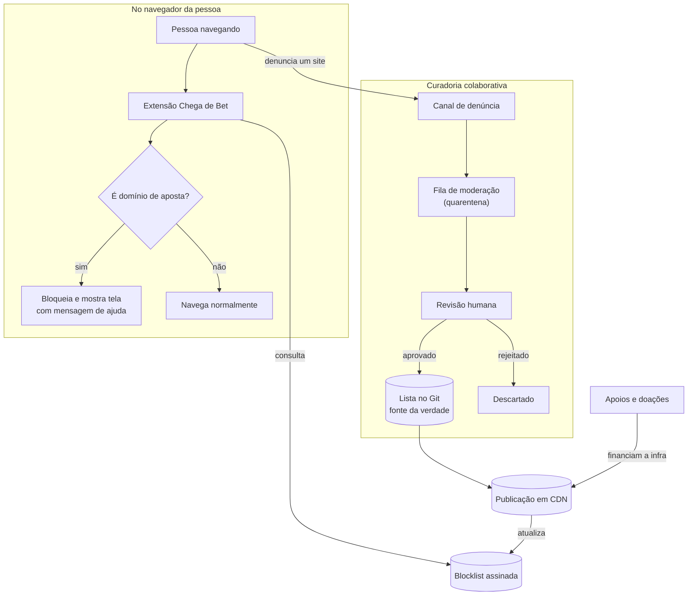
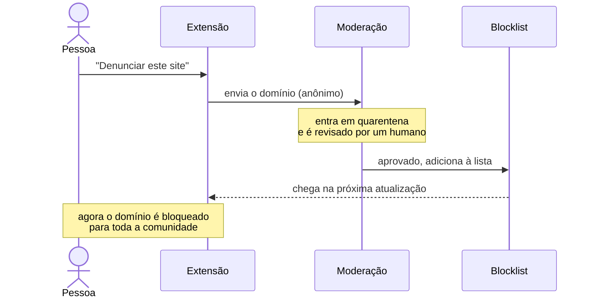
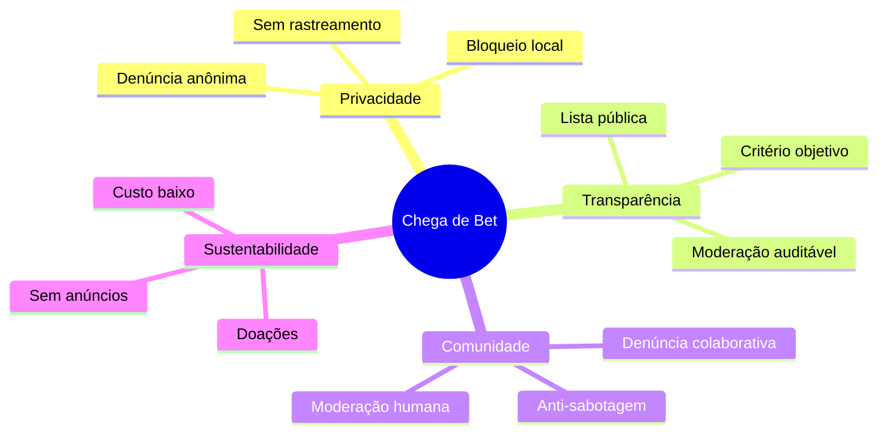

# Visão geral da ideia

Este documento mostra, em alto nível, **como o Chega de Bet funciona como ideia** — o ciclo entre quem usa, a comunidade que denuncia e a lista que bloqueia. Os detalhes internos de implementação ficam na documentação técnica do projeto.

## O ciclo do projeto

A extensão bloqueia localmente com base numa lista; a comunidade alimenta essa lista por denúncia; a moderação humana decide o que entra; e doações pagam a infraestrutura que distribui a lista de volta para todo mundo.

## Da denúncia ao bloqueio

Ninguém é bloqueado só porque uma pessoa denunciou: toda denúncia passa por quarentena e revisão humana antes de virar bloqueio para a comunidade inteira.

## Os pilares

---

> Cobertura nunca será 100% — o objetivo é **reduzir a exposição** a anúncios e domínios de aposta, não prometer bloqueio perfeito.
